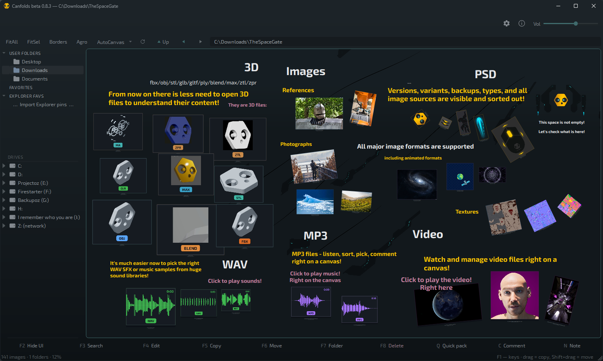
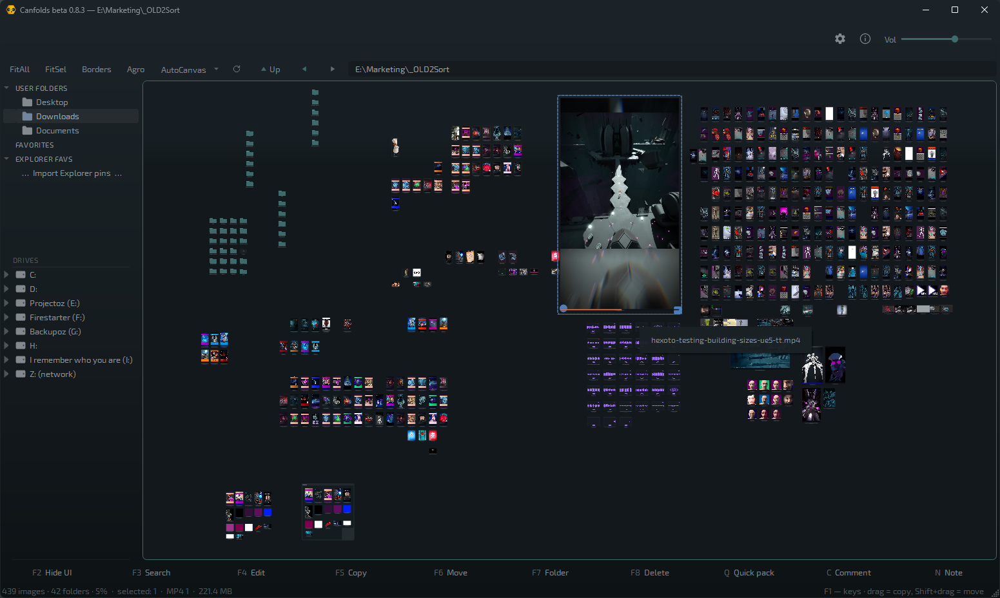
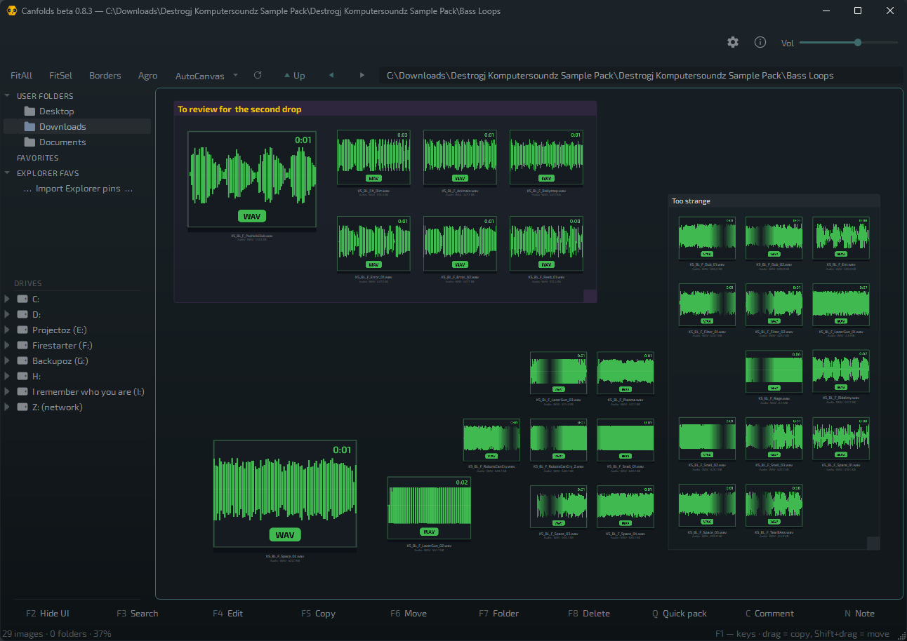
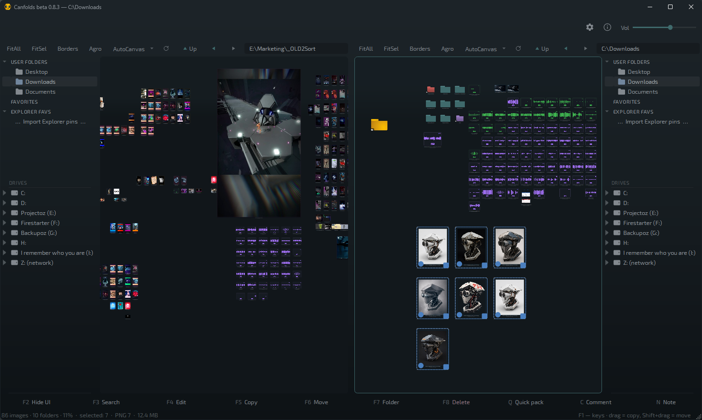

# Canfolds

**Folders are canvases.**

Windows · Freeware · Beta

Canfolds is a dual-pane file browser where every folder opens as a freely
arranged canvas: lay out images, video, sound and 3D models — with scale,
rotation, groups and comments — while the files stay ordinary files on
disk. Nothing gets imported or locked inside the app: delete the hidden
layout file and it's a plain folder again.

> **Beta, free software.** Canfolds is designed to never modify, move, or
> delete your files without an explicit action on your part, and canvas
> layouts back themselves up automatically. Even so, back up anything
> irreplaceable before trying it on real folders — see
> [LICENSE.txt](LICENSE.txt) for the full notice.

## Screenshots

<table>
<tr>
<td width="50%"></td>
<td width="50%"></td>
</tr>
<tr>
<td width="50%"></td>
<td width="50%"></td>
</tr>
</table>

## Highlights

- **The layout lives inside the folder** — a tiny hidden sidecar file, not
  a database or a project you import into. Move the folder anywhere and
  the board travels with it. Delete the sidecar and you have a plain
  folder again.
- **Dual-pane, drag-to-sort** — drag files, or whole selections with their
  comment frames, between two canvases; files actually move, keeping their
  arrangement.
- **Not just pictures** — PSD/PSB render a real flattened composite, video
  plays with scrubbing right on the card, audio gets a readable waveform,
  3D models get their own preview, no other software required.
- **Familiar canvas tools** — Arrange / Align / Distribute / Normalize
  with a shared anchor across a whole group, 15°-snapped rotation,
  Z-order, comment frames and markdown notes.
- **Your work is sacred** — atomic writes, automatic layout backups (20
  revisions, one click to restore), undo for both canvas edits and file
  operations.
- **Fast by architecture** — the UI thread never touches the disk. A
  folder with thousands of files, or a dead network share, can't freeze
  the window.
- **Optional web gallery** — mirror a folder to your own FTP/web hosting
  as a small, password-protected page; browse your images from any
  device, anywhere. Needs a web host of your own — `F1` in the app for
  the full walkthrough.
- **Portable** — one exe, nothing to install. Carry it on a USB stick.

## Download

Grab the latest `Canfolds.exe` from [Releases](../../releases) and run it
— nothing to install. Requires Windows 10/11 x64.

First launch may trigger a Windows SmartScreen prompt (the exe isn't
code-signed yet) — "More info" → "Run anyway".

## Quick start

1. Launch `Canfolds.exe` — two panes appear, each with a folder tree, an
   address bar and a canvas.
2. Click a folder in the tree, or double-click one on the canvas, to open
   it. A folder with no saved layout opens as a neat grid.
3. Drag images around; pull the bottom-right corner to scale. Select
   several and press `C` for a comment frame that groups and labels them.
4. Right-click empty canvas for **Arrange** — Optimal pack, by
   name/date/type, Align, Distribute, Normalize.
5. `F5`/`F6` copy/move the selection to the other pane — the arrangement
   and comment frames travel with it. `Ctrl+Z` undoes canvas edits
   silently and asks first for file operations.

Everything above auto-saves into a hidden `.canfolds.save` inside the
folder. Merely browsing never creates anything. Full reference: `F1` in
the app for the shortcut legend.

## What Canfolds writes to disk

| What | Where |
|---|---|
| Canvas layouts | hidden `.canfolds.save` inside folders you arranged |
| Settings | `%APPDATA%\Canfolds\Canfolds.ini` |
| Thumbnail cache | `%LOCALAPPDATA%\Canfolds\Canfolds\cache\thumbs` |
| Layout backups | `%LOCALAPPDATA%\Canfolds\backups\` |

Your images and other files themselves are never modified. Uninstalling is
deleting the exe and, optionally, the locations above.

## Why

Anyone who works with visual material lives between two worlds. Reference
boards make arranging easy, but the material gets swallowed into the app
or the cloud — cut off from the file system, often duplicated, no longer
manageable as files. File managers keep files real, but browsing is a
rigid grid of identical thumbnails sorted by name or date — no arranging
by meaning, no grouping, no notes. Sorting out a real visual dump —
references, footage, screenshots, sound, assets — needs both at once.
Canfolds is both at once: a real file manager whose view is a canvas.

## Background

Canfolds was built while developing the game **Hexoto: Project Mutoboto**
([hexotogame.com](https://hexotogame.com)) — it grew out of a real need to
manage, sort and review visual assets during production, and turned out
useful enough on its own to share for free.

If you enjoy Canfolds, consider wishlisting Hexoto
([hexotogame.com/q](https://hexotogame.com/q)) or following along on
Telegram: [@hexoto](https://t.me/hexoto).

## License

Free for personal and commercial use, portable, nothing installed. This is
beta software — see [LICENSE.txt](LICENSE.txt) for the full terms,
including a plain-language note about backing up your files.

## Feedback

Found a bug or have an idea? Open an [issue](../../issues). You can also
reach the developer on Telegram: [@konslid](https://t.me/konslid).
