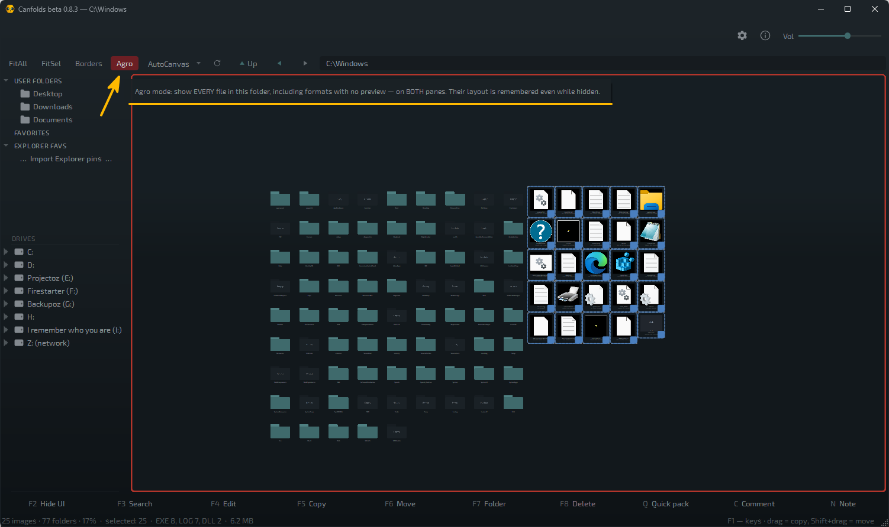
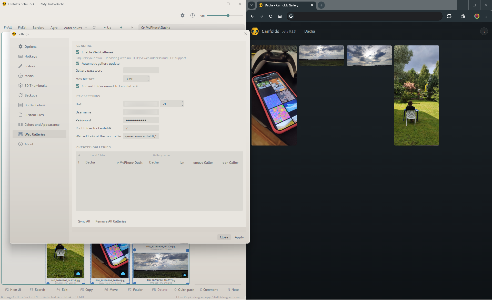

# Canfolds

**Folders are canvases.**

Windows · Free · Portable · Beta

Arrange images, play video, listen to MP3 and WAV, preview 3D — right on the
canvas, while you sort. Nothing gets imported, nothing gets locked in: folders
stay folders, they just become canvases.

---

## What it does

### Lay out your photos, images, references

`PNG` `JPG` `WEBP` `TIFF` `TGA` `GIF` `SVG` and layered `PSD` `PSB` `KRA` `CLIP`
laid out freely — scale, rotation snapped to 15°, comment frames that group and
label a selection, markdown notes for critique and to-dos. Colour-coded borders
per format keep five hundred cards readable at a glance, and mask search (`F3`)
dims everything that doesn't match. A double-click opens the file in whatever
editor you already use — it was never anywhere but the folder.

Folders live on the canvas too: drop a couple of images next to one and you've
labelled it better than any filename could.

### Sort across two canvases

Two panes side by side, each with its own tree and canvas — and a real file
manager underneath: copy, move, rename, **pack-rename** a whole selection at
once, new folder, delete, undo. `Space` collapses to a single full-screen canvas
and back; the whole rhythm of the work runs off that one key.

Drag a file across and it physically moves, carrying position, scale, rotation
and comments with it. `F5` and `F6` copy and move a whole selection without
reaching for the mouse. **Agro mode** shows every file on the disk, not just the
ones with previews, and manages them the same way.

### Play it where it lies

Video plays and scrubs right on the card — `MP4` `MOV` `AVI` `MKV` `WEBM` `WMV`
`M4V` `MPG` `MPEG`. Audio gets a real waveform with peak and RMS modes and
frequency emphasis, plays on click, and sorts by length so one-shots and loops
stop mixing — `MP3` `WAV`.

3D previews with no 3D package installed at all: `FBX` `OBJ` `STL` `GLB` `GLTF`
`PLY` `3MF` `DAE` — and, the part nobody expects, `BLEND` `MAX` `ZTL` `ZPR` show
the viewport the artist saved into the file, not a generic placeholder. Text
scenes like `MA` are parsed straight from the geometry. `PSD` `PSB` render a true
flattened composite, not the embedded thumbnail.

You audition and sort in the same gesture.

---

## Screenshots

<table>
<tr>
<td width="50%"></td>
<td width="50%"></td>
</tr>
<tr>
<td width="50%"></td>
<td width="50%"></td>
</tr>
<tr>
<td width="50%"></td>
<td width="50%"></td>
</tr>
</table>

---

## Also in the box

- **The layout lives inside the folder** — a tiny hidden sidecar file, not a
  database or a project you import into. Move the folder anywhere and the board
  travels with it. Delete the sidecar and you have a plain folder again.
- **Your work is sacred** — atomic writes, automatic layout backups (20
  revisions, one click to restore), undo for both canvas edits and file
  operations.
- **Dark and light** — dark by default; light is a first-class option, with its
  own colour values for file borders, the active-pane frame and the Agro
  highlight.
- **Nine interface languages** — EN, RU, DE, ES, FR, PT, ZH, JA, KO, switched
  live from the settings, no restart.
- **In and out, fast** — drag files onto the canvas or off it to anywhere. Paste
  an image straight from the clipboard — not a file, the picture itself — and it
  lands as a PNG.
- **Familiar canvas tools** — Arrange / Align / Distribute / Normalize with a
  shared anchor across a whole group, 15°-snapped rotation and flip, Z-order,
  comment frames and markdown notes.
- **In sync with the rest of your desktop** — save a picture in another app and
  its card refreshes itself here, thumbnail and caption both, even while Canfolds
  sits on a second monitor in the background.
- **Fast by architecture** — the UI thread never touches the disk. A folder with
  thousands of files, or a dead network share, can't freeze the window.
- **Optional web gallery** — mirror a folder to your own FTP/web hosting as a
  small, password-protected page; browse your images from any device. Needs a web
  host of your own — see Settings → Web Galleries in the app.
- **Portable** — one exe, nothing to install. Copy it to a USB stick together
  with an arranged folder and open the same layout on any other machine.

---

## Download

Grab the latest `Canfolds_beta_<version>_windows.zip` from
[Releases](../../releases), extract it anywhere, and run the `.exe` inside —
nothing to install. Requires Windows 10/11 x64.

## Is it safe?

Canfolds isn't code-signed yet — a certificate costs real money and this is a
free tool, so signing is on the list, not in the build. Windows will show a
SmartScreen prompt on first launch: **More info → Run anyway**.

What you can check instead:

- VirusTotal scan of the [release zip](PASTE_LINK) and of the [exe](PASTE_LINK)
- It's portable: it writes nothing outside the folders you arrange, plus its own
  settings and thumbnail cache (see *What Canfolds writes to disk* below).
  Uninstalling is deleting the folder.
- No network access at all, except the optional Web Gallery — and that only talks
  to the FTP host you configure yourself.

A couple of engines may flag the exe as suspicious. That's a generic heuristic for
unsigned, packed executables, not a detection.

## Quick start

1. Launch the extracted `.exe` — two panes appear, each with a folder tree, an
   address bar and a canvas.
2. Click a folder in the tree, or double-click one on the canvas, to open it. A
   folder with no saved layout opens as a neat grid.
3. Drag images around; pull the bottom-right corner to scale. Select several and
   press `C` for a comment frame that groups and labels them.
4. Right-click empty canvas for **Arrange** — Optimal pack, by name/date/type,
   Align, Distribute, Normalize.
5. `F5`/`F6` copy/move the selection to the other pane — the arrangement and
   comment frames travel with it. `Ctrl+Z` undoes canvas edits silently and asks
   first for file operations.

Everything above auto-saves into a hidden `.canfolds.save` inside the folder.
Merely browsing never creates anything. Full reference: `F1` in the app for the
shortcut legend.

## What Canfolds writes to disk

| What | Where |
|---|---|
| Canvas layouts | hidden `.canfolds.save` inside folders you arranged |
| Settings | `%APPDATA%\Canfolds\Canfolds.ini` |
| Thumbnail cache | `%LOCALAPPDATA%\Canfolds\Canfolds\cache\thumbs` |
| Layout backups | `%LOCALAPPDATA%\Canfolds\backups\` |

Your images and other files themselves are never modified. Uninstalling is
deleting the exe and, optionally, the locations above.

## Why

Anyone who works with visual material lives between two worlds. Reference boards
make arranging easy, but the material gets swallowed into the app or the cloud —
cut off from the file system, often duplicated, no longer manageable as files.
File managers keep files real, but browsing is a rigid grid of identical
thumbnails sorted by name or date — no arranging by meaning, no grouping, no
notes. Sorting out a real visual dump — references, footage, screenshots, sound,
assets — needs both at once. Canfolds is both at once: a real file manager whose
view is a canvas.

## Background

Canfolds was built while developing the game **Hexoto: Project Mutoboto**
([hexotogame.com](https://hexotogame.com)) — it grew out of a real need to manage,
sort and review visual assets during production, and turned out useful enough on
its own to share for free.

If you enjoy Canfolds, consider wishlisting Hexoto
([hexotogame.com/q](https://hexotogame.com/q)) or following along on Telegram:
[@hexoto](https://t.me/hexoto).

## License

Free for personal and commercial use, portable, nothing installed. This is beta
software — see [LICENSE.txt](LICENSE.txt) for the full terms, including a
plain-language note about backing up your files.

## Feedback

Found a bug or have an idea? Open an [issue](../../issues). You can also reach the
developer on Telegram: [@konslid](https://t.me/konslid).
